🌍 [READ THIS IN ENGLISH](README_en.md)
🌍 [日本語で読む](README_ja.md)

📃 **LangChain-Chatchat** (原 Langchain-ChatGLM)

基于 ChatGLM 等大语言模型与 Langchain 等应用框架实现，开源、可离线部署的检索增强生成(RAG)大模型知识库项目。

### ⚠️ 重要提示

`0.2.10`将会是`0.2.x`系列的最后一个版本，`0.2.x`系列版本将会停止更新和技术支持，全力研发具有更强应用性的 `Langchain-Chatchat 0.3.x`。
`0.2.10` 的后续 bug 修复将会直接推送到`master`分支，而不在进行版本更新。

---

## 目录

- [介绍](README.md#介绍)
- [解决的痛点](README.md#解决的痛点)
- [快速上手](README.md#快速上手)
  - [1. 环境配置](README.md#1-环境配置)
  - [2. 模型下载](README.md#2-模型下载)
  - [3. 初始化知识库和配置文件](README.md#3-初始化知识库和配置文件)
  - [4. 一键启动](README.md#4-一键启动)
  - [5. 启动界面示例](README.md#5-启动界面示例)
- [联系我们](README.md#联系我们)

## 介绍

🤖️ 一种利用 [langchain](https://github.com/langchain-ai/langchain)
思想实现的基于本地知识库的问答应用，目标期望建立一套对中文场景与开源模型支持友好、可离线运行的知识库问答解决方案。

💡 受 [GanymedeNil](https://github.com/GanymedeNil) 的项目 [document.ai](https://github.com/GanymedeNil/document.ai)
和 [AlexZhangji](https://github.com/AlexZhangji)
创建的 [ChatGLM-6B Pull Request](https://github.com/THUDM/ChatGLM-6B/pull/216)
启发，建立了全流程可使用开源模型实现的本地知识库问答应用。本项目的最新版本中通过使用 [FastChat](https://github.com/lm-sys/FastChat)
接入 Vicuna, Alpaca, LLaMA, Koala, RWKV 等模型，依托于 [langchain](https://github.com/langchain-ai/langchain)
框架支持通过基于 [FastAPI](https://github.com/tiangolo/fastapi) 提供的 API
调用服务，或使用基于 [Streamlit](https://github.com/streamlit/streamlit) 的 WebUI 进行操作。

✅ 依托于本项目支持的开源 LLM 与 Embedding 模型，本项目可实现全部使用**开源**模型**离线私有部署**。与此同时，本项目也支持
OpenAI GPT API 的调用，并将在后续持续扩充对各类模型及模型 API 的接入。

⛓️ 本项目实现原理如下图所示，过程包括加载文件 -> 读取文本 -> 文本分割 -> 文本向量化 -> 问句向量化 ->
在文本向量中匹配出与问句向量最相似的 `top k`个 -> 匹配出的文本作为上下文和问题一起添加到 `prompt`中 -> 提交给 `LLM`生成回答。

📺 [原理介绍视频](https://www.bilibili.com/video/BV13M4y1e7cN/?share_source=copy_web&vd_source=e6c5aafe684f30fbe41925d61ca6d514)


从文档处理角度来看，实现流程如下：


🚩 本项目未涉及微调、训练过程，但可利用微调或训练对本项目效果进行优化。

🌐 [AutoDL 镜像](https://www.codewithgpu.com/i/chatchat-space/Langchain-Chatchat/Langchain-Chatchat) 中 `0.2.10`

版本所使用代码已更新至本项目 `v0.2.10` 版本。

🐳 [Docker 镜像](registry.cn-beijing.aliyuncs.com/chatchat/chatchat:0.2.7) 已经更新到 `0.2.7` 版本。

🌲 一行命令运行 Docker ：

```shell
docker run -d --gpus all -p 80:8501 registry.cn-beijing.aliyuncs.com/chatchat/chatchat:0.2.7
```

🧩 本项目有一个非常完整的[Wiki](https://github.com/chatchat-space/Langchain-Chatchat/wiki/) ， README 只是一个简单的介绍，\_
\_仅仅是入门教程，能够基础运行\_\_。
如果你想要更深入的了解本项目，或者想对本项目做出贡献。请移步 [Wiki](https://github.com/chatchat-space/Langchain-Chatchat/wiki/)
界面

## 解决的痛点

该项目是一个可以实现 **完全本地化**推理的知识库增强方案, 重点解决数据安全保护，私域化部署的企业痛点。
本开源方案采用`Apache License`，可以免费商用，无需付费。

我们支持市面上主流的本地大语言模型和 Embedding 模型，支持开源的本地向量数据库。
支持列表详见[Wiki](https://github.com/chatchat-space/Langchain-Chatchat/wiki/)

## 快速上手

### 1. 环境配置

Ubuntu系统环境下GPU驱动+CUDA+cuDNN的安装方法
1. 下载安装文件
[NVIDIA CUDA Toolkit Archive](https://developer.nvidia.com/cuda-toolkit-archive)
点击上面链接，进入CUDA Toolkit Archive，下载需要的CUDA工具包，本文章以CUDA Toolkit 12.3.2 版本举例（可能需要代理加速访问网页）

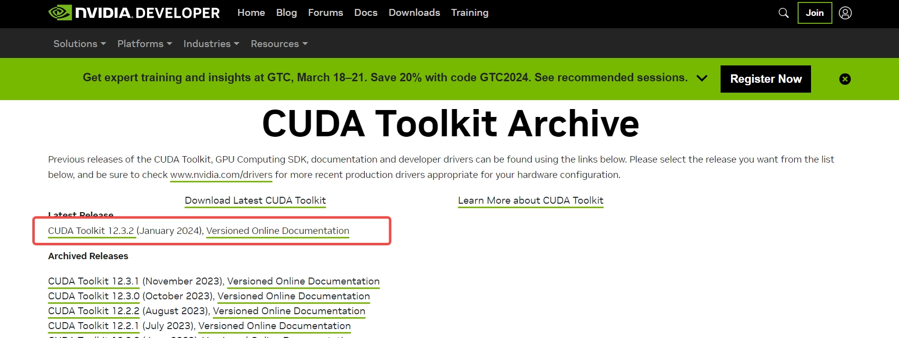

选择对应的系统，架构，发行版本，选择run文件安装方式

（可在服务器中输入uname -a查看当前服务器系统版本信息）

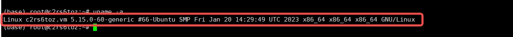

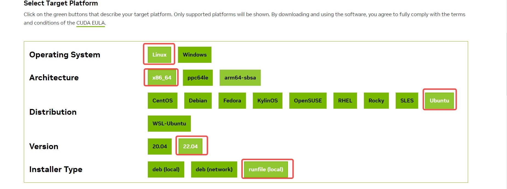

选择完后会出现run文件下载链接，可复制wget命令直接在服务器中下载，也可复制下载链接到浏览器上，通过本地浏览器下载再上传至服务器中。

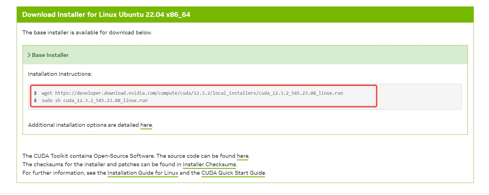

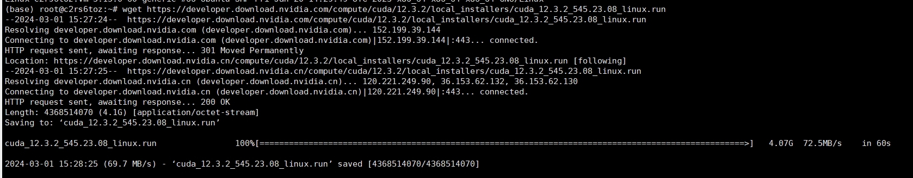

2. 禁用 nouveau 驱动

```shell
$ sudo vim /etc/modprobe.d/blacklist-nouveau.conf
```

文件最后加入以下内容

```
blacklist nouveau
options nouveau.modeset=0
```
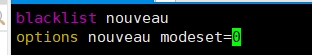

更新使其生效

```shell
$ sudo update-initramfs -u
```


重启机器

```bash
$ reboot
```

重启后查看确认

```bash
$ lsmod | grep nouveau
```
没有内容输出，说明禁用成功

3. 安装gcc/cmake

依次执行

```shell
$ sudo apt-get update
$ sudo apt-get install gcc
$ sudo apt-get install cmake
```

查看gcc版本

```shell
$ gcc --version
$ cmake --version
```
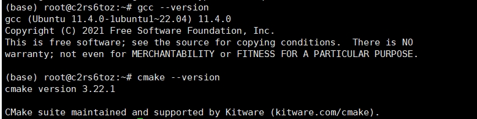

4. 运行安装文件

输入ls命令查看运行文件

输入chmod -x {文件名}赋予run文件执行权限

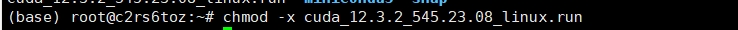

输入sh {文件名}运行run文件


等待一会儿后会弹出NVIDIA用户协议输入accept同意

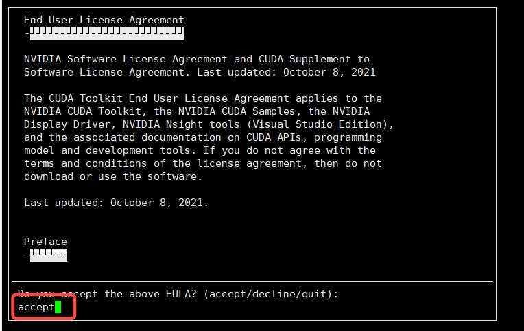

默认选中显卡驱动，选择install一起安装即可

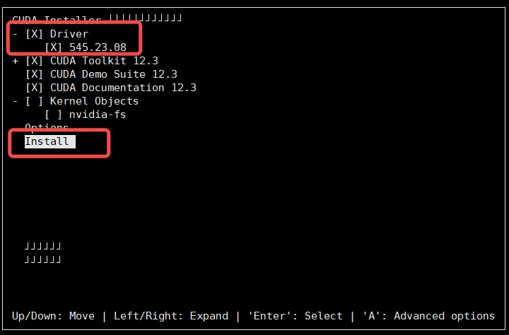

等待程序运行，需要等待一会儿。。。。

安装完成后，如下图

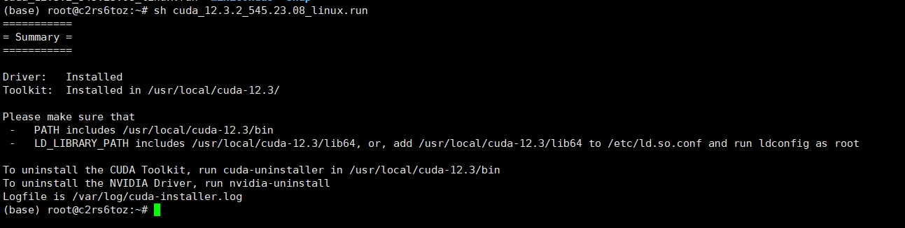

添加自己需要的cuda版本到环境变量, vim ~/.bashrc，添加以下内容到最后，如：

```shell
$ export PATH=/usr/local/cuda-12.3/bin:$PATH                                                                                                                                                                                                 
$ export LD_LIBRARY_PATH=/usr/local/cuda-12.3/lib64:$LD_LIBRARY_PATH
```

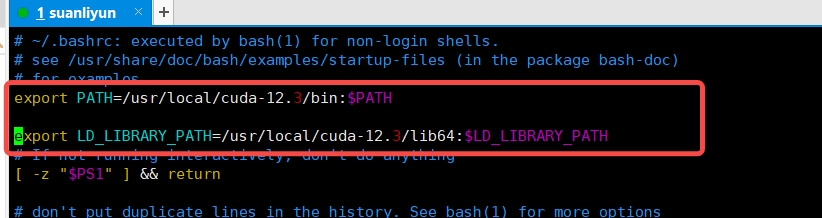

内容输入后，:wq 保存退出，
输入source ~/.bashrc  更新环境变量使刚刚输入的环境变量生效，输入nvcc -V 查看CUDA版本


输入命令nvidia-smi查看显卡驱动与CUDA版本，如下图所示，说明安装成功。

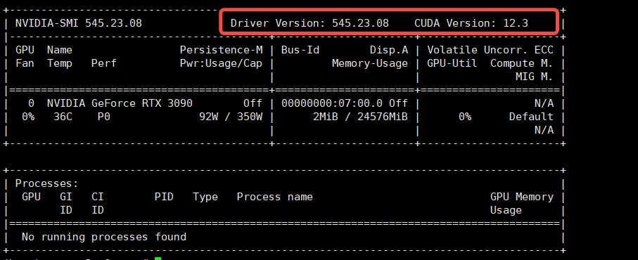

5. 配置cuDNN库

cuDNN比CUDA安装简单，下载对应版本压缩包，拷贝文件到指定目录，给予权限就好了。

需要登录NVIDIA账号
[cuDNN官方下载地址](https://developer.nvidia.com/rdp/cudnn-archive)

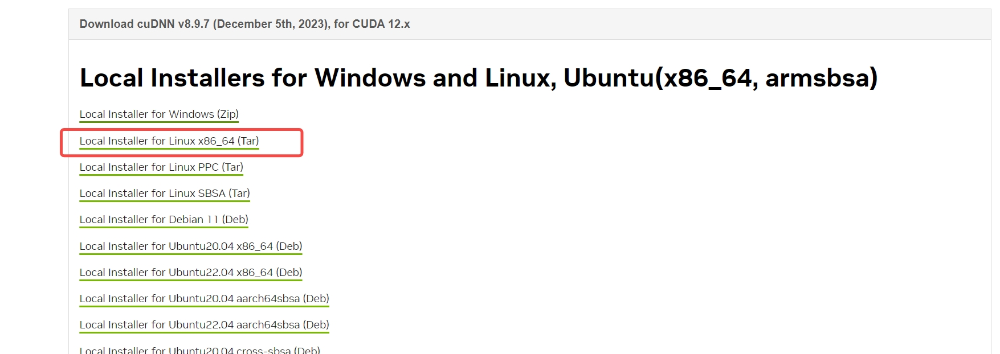

将tar包下载至服务器上，解压tar包，并将文件cp至对应位置命令如下：

```shell
$ tar -xvf cudnn-linux-$arch-8.x.x.x_cudaX.Y-archive.tar.xz
$ cp cudnn-*-archive/include/cudnn*.h /usr/local/cuda/include 
$ cp -P cudnn-*-archive/lib/libcudnn* /usr/local/cuda/lib64 
$ chmod a+r /usr/local/cuda/include/cudnn*.h /usr/local/cuda/lib64/libcudnn*

#加上版本号后，实际执行命令如下
$ tar -xvf cudnn-linux-x86_64-8.9.7.29_cuda12-archive.tar.xz  
$ cp cudnn-linux-x86_64-8.9.7.29_cuda12-archive/include/cudnn*.h /usr/local/cuda/include
$ cp -P cudnn-linux-x86_64-8.9.7.29_cuda12-archive/lib/libcudnn* /usr/local/cuda/lib64
$ chmod a+r /usr/local/cuda/include/cudnn*.h /usr/local/cuda/lib64/libcudnn*
```

使用以下命令查看cuDNN是否配置完成

```shell
$ cat /usr/local/cuda/include/cudnn_version.h | grep CUDNN_MAJOR -A 2   
```

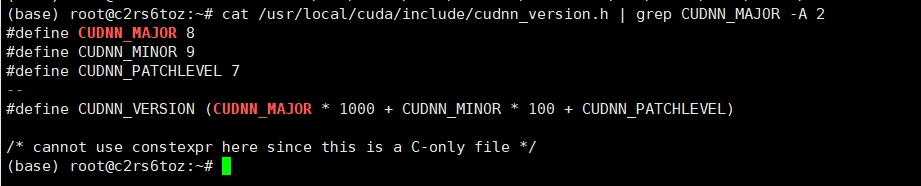


#### 安装 Python 3.11

1. **添加 DeadSnakes PPA**：
   为了获取更多 Python 版本的访问权限，首先需要添加 DeadSnakes PPA 到你的 linux 系统，我用的是Ubuntu。在终端执行以下命令：

   ```bash
   sudo apt update
   sudo apt install software-properties-common
   sudo add-apt-repository ppa:deadsnakes/ppa
   ```

2. **安装 Python 3.11**：
   添加 PPA 之后，使用下列命令安装 Python 3.11：

   ```bash
   sudo apt update
   sudo apt install python3.11
   ```

3. **验证 Python 安装**：
   确认 Python 3.11 安装成功：

   ```bash
   python3.11 --version
   ```

#### 配置 Python 和 pip 别名（可选）

为了简化命令，你可以设置`python`和`pip`的别名。在`~/.bashrc`或`~/.zshrc`文件中添加以下行：

```bash
alias python=python3.11
```

#### 安装 pip

确保为 Python 3.11 安装`pip`：

```bash
sudo apt update
sudo apt install python3-pip
```

#### 创建和激活虚拟环境

为了隔离项目依赖，推荐为每个项目创建一个虚拟环境。

1. **创建虚拟环境**：
   首先，确认已安装 Python 3.11，然后创建虚拟环境：

   ```bash
   python3.11 -m venv myenv
   ```

   这里`myenv`是虚拟环境的名称，这个命令在当前目录下创建名为`myenv`的文件夹，内含虚拟环境。

2. **激活虚拟环境**：
   创建虚拟环境后，激活它以开始在其中安装依赖和运行项目。在 Linux 或 macOS 上，使用以下命令：

   ```bash
   source myenv/bin/activate
   ```

通过以上步骤，你的 Linux 系统将为 Python 开发配置好所需的环境，包括 Python 的安装、虚拟环境的设置及`pip`的配置。

如下载资源过慢可调整pip使用清华源

```
#设置清华源，加速安装
pip config set global.index-url https://pypi.tuna.tsinghua.edu.cn/simple
```

```shell

# 拉取仓库
$ git clone https://github.com/chatchat-space/Langchain-Chatchat.git

# 进入目录
$ cd Langchain-Chatchat

# 安装全部依赖
$ pip install -r requirements.txt
$ pip install -r requirements_api.txt
$ pip install -r requirements_webui.txt

# 默认依赖包括基本运行环境（FAISS向量库）。如果要使用 milvus/pg_vector 等向量库，请将 requirements.txt 中相应依赖取消注释再安装。
```

请注意，LangChain-Chatchat `0.2.x` 系列是针对 Langchain `0.0.x` 系列版本的，如果你使用的是 Langchain `0.1.x`
系列版本，需要降级您的`Langchain`版本。

### 2， 模型下载

如需在本地或离线环境下运行本项目，需要首先将项目所需的模型下载至本地，通常开源 LLM 与 Embedding
模型可以从 [HuggingFace](https://huggingface.co/models) 下载。

以本项目中默认使用的 LLM 模型 [THUDM/ChatGLM3-6B](https://huggingface.co/THUDM/chatglm3-6b) 与 Embedding
模型 [BAAI/bge-large-zh](https://huggingface.co/BAAI/bge-large-zh) 为例：

下载模型需要先[安装 Git LFS](https://docs.github.com/zh/repositories/working-with-files/managing-large-files/installing-git-large-file-storage)
，然后运行

ubuntu 安装 Git LFS

```Shell
# 更新包列表：首先，打开终端并运行以下命令来更新你的包管理器的包列表：
$ sudo apt update
# 安装Git LFS：使用apt包管理器安装Git LFS：
$ sudo apt-get install git-lfs
# 设置Git LFS：安装完成后，你需要设置Git LFS。使用以下命令来初始化Git LFS：
$ git lfs install
```

```Shell
$ git lfs install
$ git clone https://huggingface.co/THUDM/chatglm3-6b
$ git clone https://huggingface.co/BAAI/bge-large-zh
```

### 3. 初始化知识库和配置文件

按照下列方式初始化自己的知识库和简单的复制配置文件

```shell
$ python copy_config_example.py
$ python init_database.py --recreate-vs
```

### 4. 一键启动

按照以下命令启动项目

```shell
$ python startup.py -a
```

### 5. 启动界面示例

如果正常启动，你将能看到以下界面

1. FastAPI Docs 界面


2. Web UI 启动界面示例：

- Web UI 对话界面：


- Web UI 知识库管理页面：


### 注意

以上方式只是为了快速上手，如果需要更多的功能和自定义启动方式
，请参考[Wiki](https://github.com/chatchat-space/Langchain-Chatchat/wiki/)

---

## 项目里程碑

- `2023年4月`: `Langchain-ChatGLM 0.1.0` 发布，支持基于 ChatGLM-6B 模型的本地知识库问答。
- `2023年8月`: `Langchain-ChatGLM` 改名为 `Langchain-Chatchat`，`0.2.0` 发布，使用 `fastchat` 作为模型加载方案，支持更多的模型和数据库。
- `2023年10月`: `Langchain-Chatchat 0.2.5` 发布，推出 Agent 内容，开源项目在`Founder Park & Zhipu AI & Zilliz`
  举办的黑客马拉松获得三等奖。
- `2023年12月`: `Langchain-Chatchat` 开源项目获得超过 **20K** stars.
- `2024年1月`: `LangChain 0.1.x` 推出，`Langchain-Chatchat 0.2.x` 发布稳定版本`0.2.10`
  后将停止更新和技术支持，全力研发具有更强应用性的 `Langchain-Chatchat 0.3.x`。

- 🔥 让我们一起期待未来 Chatchat 的故事 ···

---

## 联系我们

### Telegram

[](https://t.me/+RjliQ3jnJ1YyN2E9)

### 项目交流群


🎉 Langchain-Chatchat 项目微信交流群，如果你也对本项目感兴趣，欢迎加入群聊参与讨论交流。

### 公众号


🎉 Langchain-Chatchat 项目官方公众号，欢迎扫码关注。
